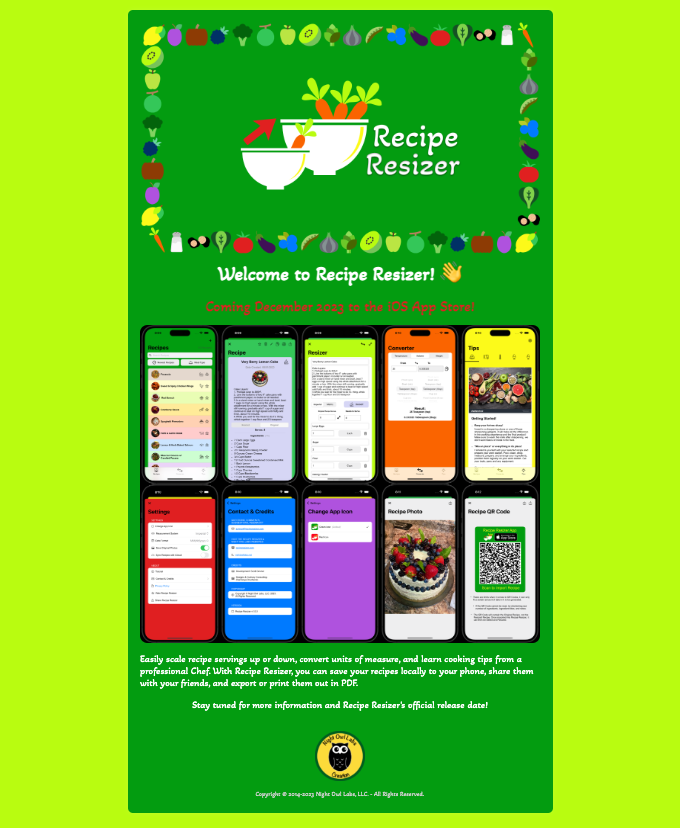

<!-- Begin README -->

[](https://nightowllabs.net)

<p align="center">
    <a href="https://www.gatsbyjs.com/"></a>
    <a href="https://react.dev/"></a>
    <a href="https://www.netlify.com/"></a>
    <br>
    <a href="https://github.com/scottgriv"></a>
    <a href="mailto:scott.grivner@gmail.com"></a>
    <a href="https://www.buymeacoffee.com/scottgriv"></a>
    <br>
    <a href="https://prgoptimized.com"></a>
</p>

--------------- 

<h1 align="center">🗃️ Business Website 💼</h1>

<p align="center">
    <a href="https://app.netlify.com/sites/nightowllabs/deploys"></a>
</p>

A dynamic and versatile static business website, expertly crafted using Gatsby for optimal performance and hosted on Netlify for reliability. This website comes with a multitude of menu options and features, catering to diverse business needs. Additionally, it includes a dedicated section for a product or app landing page, perfect for showcasing new releases, features, and driving user engagement.
- Visit the application to see it in action [here](https://nightowllabs.net)).

<div align="center">
    <a href="https://nightowllabs.net" target="_blank">
        
    </a>
    <br>
    <i>Fully customizable business website</i>
</div>
<br>
<div align="center">
    <a href="https://reciperesizer.com" target="_blank">
        
    </a>
    <br>
    <i>Optionally, you can also use it as a product or app landing page</i>
</div>
<br>
<div align="center">
    <a href="https://beeheard.com" target="_blank">
        
    </a>
    <br>
    <i>Easily change the color scheme to match your brand</i>
</div>

---------------

## Table of Contents

- [Features](#features)
- [Background Story](#background-story)
- [Getting Started](#getting-started)
    - [Installation & Set Up](#installation--set-up)
    - [Building and Running for Production](#building-and-running-for-production)
    - [Configuration](#configuration)
- [What's Inside?](#whats-inside)
- [Closing](#closing)
- [What's Next?](#whats-next)
- [Project](#project)
- [Contributing](#contributing)
- [Resources](#resources)
- [License](#license)
- [Credit](#credit)

## Features

- [x] Fully customizable
- [x] Display a product or app landing page
- [x] Mobile friendly
- [x] Easy navigation
- [x] Up arrow for easy page scrolling
- [x] Free to host and deploy using Netlify and GitHub

## Background Story

I wanted to create a **Business Website** that was easy to setup and use, while also being fully customizable, and I think I've done just that. This project is a culmination of my experience as a software developer and my passion for creating useful applications. 

## Getting Started

### Installation & Set Up

1. Install the Gatsby CLI

   ```sh
   npm install -g gatsby-cli
   ```

2. Run the development server

   ```sh
   gastby develop
   ```

3. View the website at `http://localhost:8000`


### Building and Running for Production

1. Generate a full static production build

   ```sh
   gatsby build
   ```

2. Preview the site as it will appear once deployed

   ```sh
    gatsby serve
    ```

3. View the website at `http://localhost:9000`
4. Commit to GitHub
5. Create a new site on Netlify
6. Connect your GitHub account
7. Select your repository
8. Click `Deploy Site`
9. View your website at `https://<your-site-name>.netlify.app`
10. Optionally, you can also setup a custom domain name for your website

### Configuration

You can easily configure this website to your liking by following the steps below, changing it from a full website to a preview landing page for your product or app:

1. Open the `src/components/config.js` file

2. Update the `config` object with your information

```js
export const CONFIG = {
    showLandingPage: false, // Set to false to hide the landing page
    showHeader: true, // Set to false to hide the header
    showFooter: true, // Set to false to hide the footer
  };
```

3. If you decide to use the app landing page, open the `src/components/landing.js` file to edit it and use the `static/images/landing` directory to store your images.
4. Optionally, you can also adjust the amount of time the up arrow is displayed before fading out by adjusting the `newTimeout` value in the `src/components/layout.js` file.
```js
    // Set a new timeout
    const newTimeout = setTimeout(() => {
        setShowScroll(false)
    }, 7000) // Hide button 7 seconds after scrolling stops
    setScrollTimeout(newTimeout)
```

## What's Inside?

Below is a list of the main files and folders in this repository and their specific purposes:
```bash
Business-Website
├─ src # Source folder
│  ├─ components # Components folder
│  │  ├─ config.js # Configuration file
│  │  ├─ footer.js # Footer component
│  │  ├─ header.js # Header component
│  │  ├─ index.module.css # Index module CSS file
│  │  ├─ layout.css # Layout CSS file
│  │  ├─ layout.js # Layout component
│  │  └─ seo.js # Search Engine Optimization component
│  ├─ images # Images folder
│  │  └─ icon.png # Icon image
│  ├─ pages # Pages folder
│  │  ├─ 404.js # 404 page
│  │  ├─ about.js # About page
│  │  ├─ company.js # Company page
│  │  ├─ contact.js # Contact page
│  │  ├─ faq.js # FAQ page
│  │  ├─ home.js # Home page
│  │  ├─ index.js # Index page
│  │  ├─ landing-page.js # Landing page
│  │  ├─ products.js # Products page
│  │  ├─ projects.js # Projects page
│  │  ├─ services.js # Services page
│  │  └─ using-ssr.js # Using SSR page
│  ├─ templates # Templates folder
│  │  └─ using-dsg.js # Using DSG template
│  ├─ static # Static folder
│  │  ├─ fonts # Fonts folder
│  │  └─ images # Images folder
│  │     ├─ about # About images folder
│  │     ├─ company # Company images folder
│  │     ├─ landing # Landing images folder
│  │     ├─ products # Products images folder
│  │     └─ projects # Using SSR images folder
│  │        ├─ banners # App Banners images folder
│  │        └─ icons # App Icons images folder
│  ├─ styles # Styles folder
├─ .gitignore # Git ignore file
├─ .github # GitHub folder       
├─ .prettierignore # Prettier ignore file
├─ .prettierrc # Prettier configuration file
├─ gatsby-browser.js # Gatsby browser file
├─ gatsby-config.js # Gatsby configuration file
├─ gatsby-node.js # Gatsby node file
├─ gatsby-ssr.js # Gatsby SSR file
├─ package.json # Package file
├─ PRG.md # PRG Connection File
├─ LICENSE # License file   
└─ README # This file                  
```

## Closing

Thank you for taking the time to read through this document and I hope you find it useful!
If you have any questions or suggestions, please feel free to reach out to me.
> Please reference the [SUPPORT](.github/SUPPORT.md) file in this repository for more details

## What's Next?

I'm looking forward to seeing how this project evolves over time and how it can help others with their GitHub Portfolio.
> Please reference the [CHANGELOG](.github/CHANGELOG.md) file in this repository for more details.

## Project

Please reference the [GitHub Project](https://github.com/users/scottgriv/projects/10) tab inside this repository to get a good understanding of where I'm currently at with the overall project.
- Issues and Enhancements will also be tracked there as well.

## Contributing

Feel free to submit a pull request if you find any issues or have any suggestions on how to improve this project. You can also open an issue with the tag "bug" or "enhancement".

- How to contribute:
1. Fork the Project
2. Create your Feature Branch (`git checkout -b feature/Business-Website`)
3. Commit your Changes (`git commit -m 'Add new feature'`)
4. Push to the Branch (`git push origin feature/Business-Website`)
5. Open a Pull Request

> Please reference the [CONTRIBUTING](.github/CONTRIBUTING.md) file in this repository for more details.

## Resources

- [Gatsby](https://www.gatsbyjs.com/)
- [Netlify](https://www.netlify.com/)
- [React](https://reactjs.org/)     

## License

This project is released under the terms of the **MIT License**, which permits use, modification, and distribution of the code, subject to the conditions outlined in the license.
- The [MIT License](https://choosealicense.com/licenses/mit/) provides certain freedoms while preserving rights of attribution to the original creators.
- For more details, see the [LICENSE](LICENSE) file in this repository. in this repository.

## Credits

**Author:** [Scott Grivner](https://github.com/scottgriv) <br>
**Email:** [scott.grivner@gmail.com](mailto:scott.grivner@gmail.com) <br>
**Website:** [scottgrivner.dev](https://www.scottgrivner.dev) <br>
**Reference:** [Main Branch](https://github.com/scottgriv/Business-Website) <br>

---------------

<div align="center">
    <a href="https://github.com/scottgriv/Business-Website" target="_blank">
        
    </a>
</div>
<br>
<div align="center">
    <a href="https://nightowllabs.net" target="_blank">
        
    </a>
</div>
<!-- End README -->
